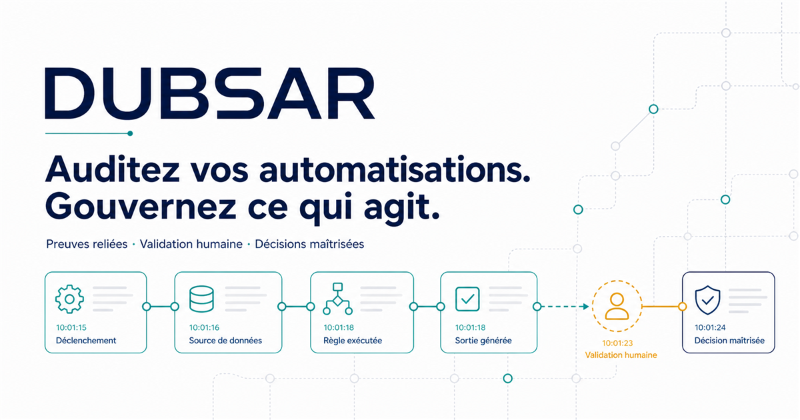

# DUBSAR Agent Skills



Portable, offline Agent Skills for automation audit preparation and
evidence-aware project continuity.

DUBSAR Agent Skills provides two small, inspectable packs for Claude Code,
Codex, Cursor, and Hermes Agent. The packs help an AI agent structure local
evidence and project context without connecting to production services,
granting itself authority, or presenting preparation work as an audit result.

> **Status:** public beta v0.1.0. The local test suite covers public-boundary
> rules, deterministic outputs, synthetic end-to-end workflows, host manifest
> resolution, and common unsafe inputs. This is not a certification of the
> packs, an audited system, or any host product.

## Why use these skills?

The packs are useful when a team needs a repeatable, reviewable workflow rather
than another free-form agent conversation:

- prepare a bounded inventory of automations or AI agents before a human audit;
- identify actions that can communicate, move money, change access, alter data,
  or otherwise create a material effect;
- separate observations, reports, derivations, assumptions, and missing
  evidence;
- turn a broad project into explicit, independently verifiable lots;
- preserve mission, execution boundaries, evidence, and next steps across
  people, tools, and sessions;
- create deterministic local review bundles and handoff summaries.

These skills prepare information for human review. They do not run an audit,
decide compliance, certify safety, execute project work, deploy software, or
operate a production DUBSAR runtime.

## The two packs

| Pack | Purpose | Main local outputs |
| --- | --- | --- |
| [`dubsar-audit-readiness`](packages/dubsar-audit-readiness/README.md) | Scope an automation or AI-agent review, inventory the environment, map sensitive actions, expose evidence gaps, and export a deterministic bundle. | `audit-scope.json`, `automation-inventory.json`, `sensitive-actions.json`, `evidence-index.json`, `evidence-review.json` |
| [`dubsar-project-continuity`](packages/dubsar-project-continuity/README.md) | Keep a significant project bounded, evidence-aware, and safely resumable across interruptions and handoffs. | `mission.json`, `lots.json`, `execution-contract.json`, `evidence.json`, deterministic handoff |

Both packs use standard `SKILL.md` folders. Their executable helpers require
Node.js 20 or newer and use only Node.js built-ins.

## All 12 skills

Each pack contains one end-to-end umbrella skill and five focused skills.

### Audit readiness

| Skill | Use it when |
| --- | --- |
| [`dubsar-audit-readiness`](packages/dubsar-audit-readiness/skills/dubsar-audit-readiness/SKILL.md) | You want the complete local audit-preparation workflow from scope through deterministic export. |
| [`frame-audit-scope`](packages/dubsar-audit-readiness/skills/frame-audit-scope/SKILL.md) | You need an explicit objective, permitted evidence, exclusions, time window, limits, and approval record. |
| [`inventory-automations`](packages/dubsar-audit-readiness/skills/inventory-automations/SKILL.md) | You need an evidence-backed inventory of automations, agents, triggers, systems, owners, and dependencies. |
| [`map-sensitive-actions`](packages/dubsar-audit-readiness/skills/map-sensitive-actions/SKILL.md) | You need to map material external effects and the human-review points around them. |
| [`review-evidence-gaps`](packages/dubsar-audit-readiness/skills/review-evidence-gaps/SKILL.md) | You need to distinguish supported observations from reports, contradictions, gaps, and assumptions. |
| [`export-audit-bundle`](packages/dubsar-audit-readiness/skills/export-audit-bundle/SKILL.md) | You have a validated workspace and need a deterministic, non-certifying bundle for human review. |

### Project continuity

| Skill | Use it when |
| --- | --- |
| [`dubsar-project-continuity`](packages/dubsar-project-continuity/skills/dubsar-project-continuity/SKILL.md) | You want the complete mission-to-handoff workflow or a single portable Hermes skill. |
| [`frame-project-mission`](packages/dubsar-project-continuity/skills/frame-project-mission/SKILL.md) | A significant project is broad, ambiguous, risky, or likely to span multiple sessions. |
| [`decompose-project-lots`](packages/dubsar-project-continuity/skills/decompose-project-lots/SKILL.md) | You need small, ordered, independently verifiable lots with dependencies and stop conditions. |
| [`draft-execution-contract`](packages/dubsar-project-continuity/skills/draft-execution-contract/SKILL.md) | You need to record the permitted actions, exclusions, proof, rollback expectations, and stop rules for one lot. |
| [`record-project-evidence`](packages/dubsar-project-continuity/skills/record-project-evidence/SKILL.md) | You need reproducible evidence without treating a plan, command, diff, or agent statement as a completed outcome. |
| [`resume-project-context`](packages/dubsar-project-continuity/skills/resume-project-context/SKILL.md) | Work was interrupted or handed off and the current state must be reconstructed without inventing progress. |

## Quick start

Clone the repository and run its dependency-free checks:

```bash
git clone https://github.com/kotnisofiane-bit/dubsar-agent-skills.git
cd dubsar-agent-skills
npm test
npm run demo
```

`npm run demo` validates the synthetic examples without writing to them or
contacting a service. A successful run reports audit material as
`ready_for_human_review` and project material as `continuity_valid`; neither
status is an audit verdict or permission to execute work.

To try the local helpers directly:

```bash
node packages/dubsar-audit-readiness/scripts/init-audit-workspace.mjs --output ./audit-case
node packages/dubsar-audit-readiness/scripts/validate-audit-workspace.mjs --root ./audit-case

node packages/dubsar-project-continuity/scripts/init-project-workspace.mjs --output ./.dubsar-project
node packages/dubsar-project-continuity/scripts/validate-project-workspace.mjs --root ./.dubsar-project
```

The helpers require explicit paths and refuse unsafe traversal, symbolic links,
and destructive overwrites.

## Install in an agent host

The repository includes thin host manifests around the same portable skill
sources:

- **Claude Code:** add the GitHub repository as a plugin marketplace, then
  install either pack.
- **Codex:** clone the repository, add its local marketplace, and install a pack
  from the plugin browser.
- **Cursor:** import or copy each package as a local plugin.
- **Hermes Agent:** add the repository as a skill tap and install either
  self-contained umbrella skill.

See [HOSTS.md](HOSTS.md) for exact commands, local-development alternatives,
and host-specific caveats.

After installation, ask for an outcome in plain language, for example:

```text
Use dubsar-audit-readiness to frame a bounded review of the automation
evidence I provide. Do not inspect anything outside the approved scope.
```

```text
Use dubsar-project-continuity to turn this project into an approved mission,
verifiable lots, and a resumable local handoff. Do not execute a lot.
```

## Safety model

The public boundary is intentionally narrow:

- no account, secret, production connector, MCP server, hook, or background
  process is required;
- runtime helpers do not read environment variables or access the network;
- paths are explicit, traversal and symbolic links are rejected, and
  non-empty output directories are not overwritten;
- JSON is stable UTF-8 with sorted keys, relative paths, and SHA-256
  inventories where applicable;
- evidence language preserves `observed`, `reported`, `derived`, and
  `unverified` distinctions;
- human confirmation remains required at scope, evidence, export, contract, and
  handoff boundaries;
- readiness, continuity, and integrity statuses describe local artifacts, not
  legal compliance, system safety, business approval, or execution authority.

Read [PUBLIC_BOUNDARY.md](PUBLIC_BOUNDARY.md) before adapting a pack to a new
domain.

## Validation and release status

Public beta validation includes:

- public-boundary scans for both packages;
- synthetic CLI and end-to-end workflows;
- deterministic audit export and project handoff checks;
- credential, path traversal, link escape, contradiction, and unsafe-markup
  cases;
- resolution checks for Claude Code, Codex, and Cursor manifests.

Run `npm test` on the exact commit you intend to use. Host marketplace
validation, fresh-profile installation, cross-platform checks, provenance
review, and the remaining release gates are tracked in
[RELEASE_CHECKLIST.md](RELEASE_CHECKLIST.md). Passing development tests is
necessary but does not make the packs certified, production-approved, or a
substitute for human review.

## Repository layout

```text
.
├── .agents/plugins/                 # Codex local marketplace
├── .claude-plugin/                  # Claude Code marketplace
├── .cursor-plugin/                  # Cursor marketplace metadata
├── packages/
│   ├── dubsar-audit-readiness/
│   └── dubsar-project-continuity/
├── skills/                          # Hermes-compatible umbrella skill view
├── examples/                        # synthetic, non-production fixtures
├── tests/                           # safety, packaging, determinism, and E2E tests
└── tools/                           # repository checks and demo runner
```

## Limits and non-affiliation

This repository is a clean-room, public preparation layer. It contains no
production DUBSAR implementation, private protocol, deployment topology,
activation or billing path, enforcement runtime, or automatic permission
grant.

Claude Code is a product of Anthropic; Codex is a product of OpenAI; Cursor is
a product of Cursor; Hermes Agent is a product of Nous Research. DUBSAR Agent
Skills is independent and is not affiliated with, endorsed by, or sponsored by
those companies. Product names and trademarks belong to their respective
owners.

Contributions are welcome under the constraints in
[CONTRIBUTING.md](CONTRIBUTING.md). The repository is available under the
[MIT License](LICENSE).
